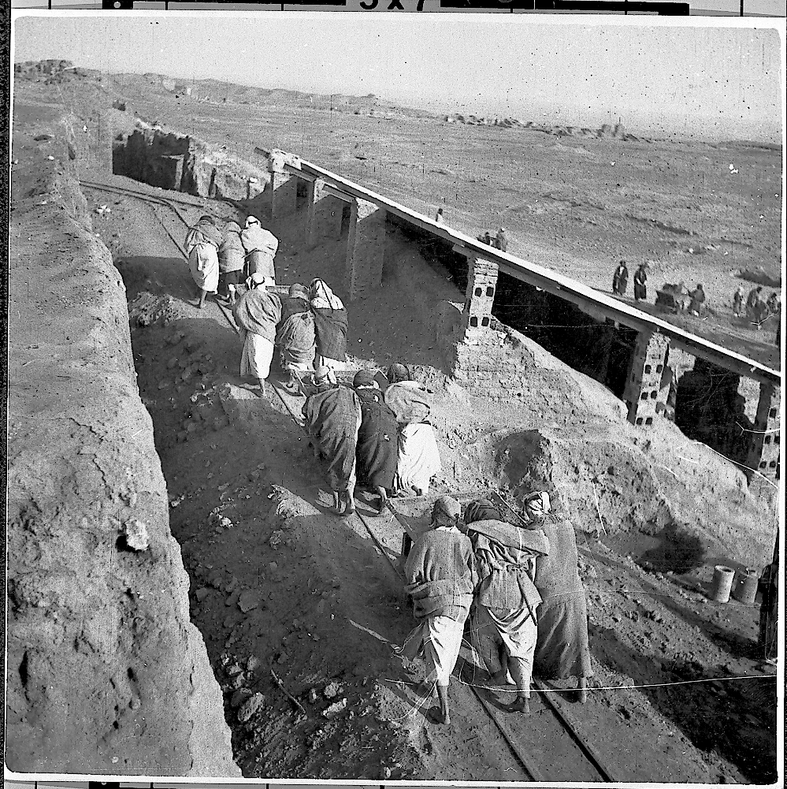

# How to create a 3D anaglyph of black and white archaeological images using GIMP
*By Samuel Papineau*
 

Many of us can remember the times in our childhoods when we would go in to the movie theater, put on a pair of 3D glasses, and watch as fantastic universes unravelled seemingly right in front of our eyes. 

While creating a 3D anaglyph might seem difficult, it is actually rather easy, and can provide an interesting perspective on old archaeological imagery. 

So the question is: How do we recreate this using black and white pictures? Or perhaps more importantly, how do we do it for free?

First, we need to find an image.

![[Pasted image 20211217171529.png]]
*Workers pushing removed dirt in rail carts. Courtesy Yale University Art Gallery, Dura-Europos Collection, z-92.*

  
## The wonderful world of GIMP
 
In a world dominated by Adobe's Photoshop, some people saw the price tag on this software and decided that it would be more economical for everyone if they made a free alternative. GIMP is a free and open source image manipulation program which has been described as being almost as powerful as photoshop, and it is a very respectable piece of software. In order to make this guide accessible to everyone, I will be using the latest version of GIMP (2.10.28 at the time of this article).

If you don't already have GIMP, you can download it [here.](https://www.gimp.org/downloads/)

  
## How to edit your image
 
Once you have installed and opened GIMP, you should see a window that looks like this: 

![[Pasted image 20211217173055.png]]

Next, click on "File", then "Open", and select the picture you want to edit. Your editor should look like this.

![[Pasted image 20211217173612.png]]

First, click on "images" at the top of the window, then click on "mode" and select RGB. This will make sure that we can use the proper colours in our image.

![[Pasted image 20211217181100.png]]

Next, what we want to do is create two new layers called "left" and "right".  These will be the red and blue layers of the anaglyph.

![[Pasted image 20211217180804.png]]

![[Pasted image 20211217180833.png]]

 Once you have created the layers, right click on one and then click "Add layer mask", then make sure you select "selection" and "invert mask". Do this for both right and left layers.
 
 ![[Pasted image 20211217181424.png]]
 ![[Pasted image 20211217181439.png]]
 
 
Your editor should look something like this

![[Pasted image 20211217181916.png]]

Next, we need to add our image to both left and right layers. To do this, press Shift + T and click on your imported image, then copy by pressing Ctrl + C. Make sure you have selected your image in the layer list, the one in my editor is named figure6.png.

![[Pasted image 20211217182331.png]]

Then select the left and right layers, and paste the image using Ctrl + V. Make sure you have selected the white square square and not the checkered square when pasting the image. When you paste an image, it is automatically selected and will have a dotted line around it. In your layer list, it will appear as a pasted layer. To remove this selection, press R and then click anywhere around the image and the selection will go away. Don't forget to return to the transform tool by pressing Shift + T. Do this for both layers.

![[Pasted image 20211217183526.png]]

![[Pasted image 20211217183649.png]]

### Adding colour

This next part deals with adding colour to the "left" and "right" layers which we have created. The first step is to click on the checkered square in the "left" layer to select it, and then click on the top coloured square under the tools in the left menu.

![[Pasted image 20211217184424.png]]

![[Pasted image 20211217184453.png]]

Next, a colour selection window will open. Make sure to move the "R" slider all the way to the right, and the G and B sliders all the way to the left, then click "ok". It should look like this. 

![[Pasted image 20211217184821.png]]

Then press Shift + B for the bucket tool, then click anywhere on the image. After this, press Shift + T and move the image slightly to the left using the transform tool, and press Enter when you have positioned it.

 Next, repeat the previous steps with the "right" layer, but this time adjust the G and B sliders so that they are all the way to the right, and the R slider all the way to the left. Remember to move the "right" layer to the right too.
 
  The colours themselves can sometimes overpower the original image, so it can be necessary to change the transparency to make sure everything is still visible. To do this, click on the layer and lower the "Opacity". I find that for black and white pictures, leaving it at 100% works well, but feel free to experiment with this.
 
 ![[Pasted image 20211217190141.png]]
 
 Lastly, I also recommend changing the default mode of the colouration. This will help prevent either the blue or red from being the dominant colour in the image by making the colours stronger in places where there are shadows. To do this, click on "Mode" and then select "HSL Color", you will need to do this for both layers. You can also use the "LCh Color" option, and in my example, I used "LCh Color" on the red and "HSL Color" on the blue. This is art after all, there are no wrong answers.
 
 ![[Pasted image 20211217190451.png]]
 
 
Your editor should now look something like this:

![[Pasted image 20211217191438.png]]

Generally you should crop your picture to make it look nicer, however I chose to leave this example the way it is since I don't think it makes a noticeable difference considering there is a thin border around the image.

 
And that's it! 

Now all you need to do is save and export your image, then pop out your 3D glasses and enjoy!

![[3D Anaglyph.png]]
